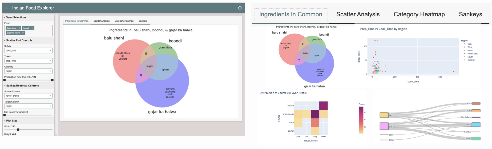

# 🍛 Indian Food Explorer

A delightful interactive dashboard that lets you explore the rich and diverse world of Indian cuisine! Built with Panel and Python, this tool helps you discover interesting patterns and relationships in Indian food data.

## ✨ Features



- **Ingredient Explorer** - Create Venn diagrams to discover common ingredients between up to three dishes
- **Scatter Analysis** - Visualize relationships between cooking time, preparation time, and other attributes. Look up individual dishes that display interesting relationships.
- **Category Heatmap** - Explore connections between different food categories
- **Sankey Diagrams** - See the flow relationships between various food attributes

## 🛠️ Technical Stack

- **Panel** - For creating the interactive dashboard
- **Plotly** - For interactive visualizations
- **Matplotlib** - For Venn diagrams
- **Pandas** - For data manipulation

## 🚀 Getting Started

1. Install the required dependencies:
```bash
pip install panel plotly matplotlib pandas
```
```plaintext
Indian Food Dashboard
